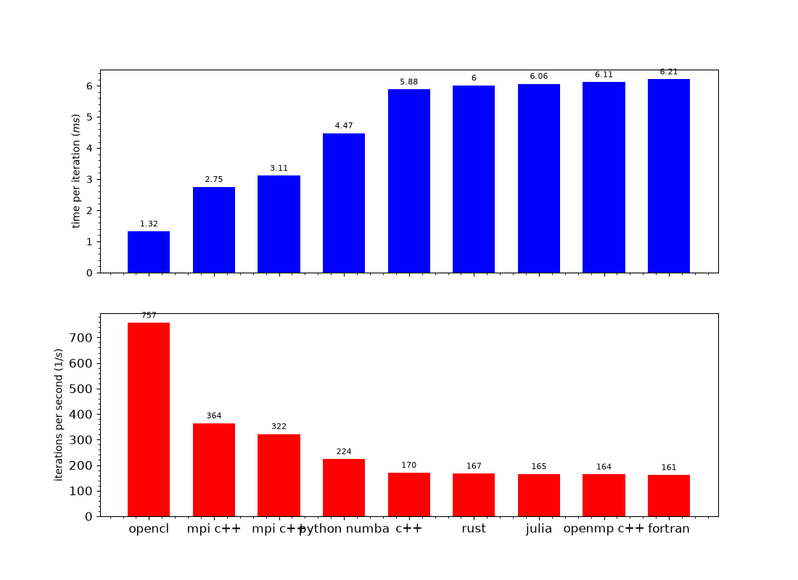
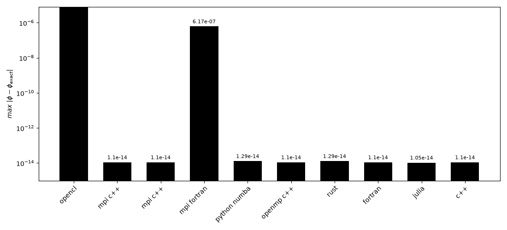

# Wave Equation Benchmarks

I use this repository to solve the one-dimensional wave equation, more precisely the linear advection equation,

$$
\frac{\partial \phi}{\partial t} = -c_0 \frac{\partial \phi}{\partial x}.
$$

I have been updating this repository from time to time. I use the wave equation to learn how to code different things each time, including new languages, numerical libraries, parallel programming models, GPU programming, build systems, data output, and performance measurement.

The wave equation is a useful starting point because it is simple enough to understand completely, while still requiring the core parts of a realistic numerical solver: a spatial grid, boundary conditions, a stable time integrator, numerical accuracy checks, data output, and careful performance measurement. Its analytical sine-wave solution also lets me measure the numerical error directly instead of treating runtime as the only result.

## Implementations

I maintain versions in C++, Fortran, OpenCL C++, Julia, OpenMP C++, MPI C++, MPI Fortran, Python, Python with Numba, and Rust. The serial versions provide reference implementations, while the OpenMP, MPI, OpenCL, and Numba versions let me compare different ways of parallelising or accelerating the same problem.

All cases use the same numerical problem:

| Setting | Value |
| --- | --- |
| Domain | Periodic, $0 \leq x < 1$ |
| Initial condition | $\phi(x, 0) = \sin(2\pi x)$ |
| Wave speed | $c_0 = 0.5$ |
| Grid points | $n_x = 2{,}000{,}000$ |
| Time step | $\Delta t = 0.0000001$ |
| Iterations | 1,000 |
| Spatial discretisation | Fourth-order central finite difference |
| Time integration | Third-order Runge-Kutta |
| CFL number | $0.1$ |

At the final time, I compare the computed solution with

$$
\phi_{\mathrm{exact}}(x,t) = \sin\left(2\pi(x-c_0t)\right).
$$

## Running The Benchmarks

[`generate_all.py`](generate_all.py) is the root runner. With `clean_setting = 0`, it builds and runs the configured implementations in turn. With `clean_setting = 1`, it runs `make clean` in every directory that has a Makefile and then exits. This keeps cleaning separate from a new benchmark run.

```bash
python generate_all.py
python plot_wave.py
python plot_benchmarks.py
```

The solver runs write solution data in their own directories. The shared plotting scripts then create a solution comparison plot for each available result and two benchmark summary images in this directory.

## Benchmark Plots

### Performance Results



The upper panel shows the time per iteration, where lower values are better. The lower panel shows iterations per second, where higher values are better. The bars are sorted by time per iteration. OpenCL is fastest in the current results because its kernels run on the GPU, while the CPU results reflect differences in compiler optimisation, memory access, runtime overhead, and parallel execution. These are results for this machine and configuration, not universal language rankings.

### Accuracy Results



The error figure shows

$$
\max_x \left|\phi(x,t) - \phi_{\mathrm{exact}}(x,t)\right|
$$

on a logarithmic scale. Most CPU implementations use double-precision floating-point arithmetic and cluster around $10^{-14}$ in the current results. The OpenCL implementation uses single precision, so its error is larger, around $10^{-5}$. This shows the expected accuracy trade-off between `float` and `double`, alongside the speed benefit of the GPU implementation.

## Output Format

Most implementations write HDF5 solution files containing `x`, `phi_numerical`, `phi_exact`, and `error`. The root [`plot_wave.py`](plot_wave.py) also supports the older text and binary output files, so I can plot results from every implementation through one script.

## Test System

All benchmark results shown above were produced on the following machine:

| Component | Details |
| --- | --- |
| Machine | MacBook Pro (14-inch, 2021) |
| CPU | Apple M1 Pro, 10 cores (8 performance + 2 efficiency) @ 3.23 GHz |
| GPU | Apple M1 Pro, 14-core integrated GPU |
| Memory | 16 GB unified |
| OS | macOS Sequoia 15.7.5 (arm64) |

The GPU results (OpenCL) run on the integrated M1 Pro GPU using the same
unified memory as the CPU, so no host–device transfer over PCIe is involved.
Results on discrete-GPU systems will differ accordingly.

### Toolchain

| Tool | Version |
| --- | --- |
| C/C++ compiler | Apple clang 17.0.0 (arm64) |
| Fortran compiler | GNU gfortran 16.1.0 (Homebrew GCC) |
| Rust | rustc 1.97.1 |
| Julia | 1.12.6 |
| Python | 3.14.6 |
| HDF5 | 2.0.0 |
| MPI | MPICH 4.3.2 (conda-forge) |
| OpenMP | 5.1 (libomp with Apple clang) |
| OpenCL | 1.2 (Apple platform, M1 Pro GPU) |